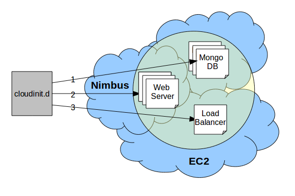

===========
cloudinit.d
===========

This guide contains configuration information about the Cloud
application coordination tool cloudinit.d.

.. toctree::
   :maxdepth: 1

   intro
   quickstart
   wordpress
   service

Solving the problems in computing often requires a set of services all
working together in concert.  As distributed computing has evolved, the
management and coordination of these services has become a complicated
task.  The advent of cloud computing has exacerbated this problem by
providing its users with an explosion of virtual resources
that need to be started, managed, monitored, and notified of each others
existence and operational state.

Very little can be assumed about the network locations of these
virtual machines, their IP addresses are dynamically provisioned and
they can be spread across many clouds potentially all over the world.
In order for the VMs to work in concert,
It is critical that communication channels are established.

How can we organize, manage, and coordinate
the bootstrap process of these ever growing cloud applications?
Infrastructure clouds have delivered the resources but can they be
leveraged in a sane and repeatable way?  Once these applications are
running how can we ensure that they continue to work and can we recover
from failures without having to waste valuable time and potential data
by completely restarting them?

To address these questions the Nimbus
Project is proud to introduce cloudinit.d.  cloudinit.d is a tool
for launching,
configuring, monitoring, and repairing a set of interdependent virtual
machines in an IaaS cloud or over a set of IaaS clouds.  A single launch
can consist of many VMs and can span multiple IaaS providers, including
offerings from commercial and academic space.

