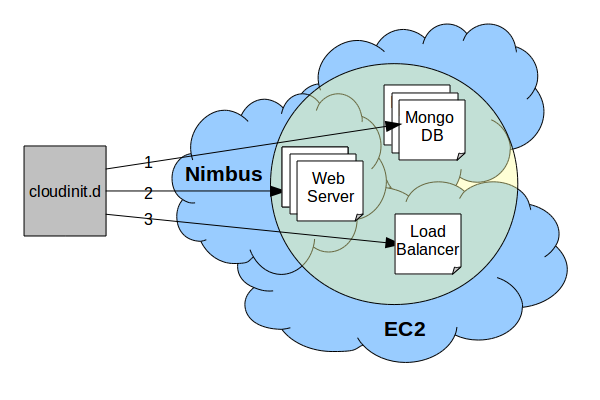

============
Introduction
============

cloudinit.d is a tool for launching, controlling, and monitoring cloud
applications.  If the application is simple or complex, single cloud or
multi-cloud, VM based or bare metal, or any combination of the above,
cloudinit.d is designed to make the management and coordination of that
application easy.

Infrastructure clouds bring a wealth of resources to their users
(typically in the form of virtual machines).
User now have the ability to create thousands of virtual machines to
handle the needs of their applications.  The architecture of applications
is becoming much less tied to a single machine.  Applications are starting
to assume the use of reliable/redundant data stores like
`Cassandra <http://en.wikipedia.org/wiki/Apache_Cassandra>`_ and
reliable messaging services like
`RabbitMQ <http://www.rabbitmq.com>`_. While this has brought great 
opportunity, i has also brought an unruly amount
of system administration, coordination and management.

It is the goal of cloudinit.d to solve this problem.  cloudinit.d
automates the creation of virtual machines, their contextualization,
and all of the messaging between VMs needed to boot strap up today's
more complicated cloud applications.  Further, it makes this process
repeatable.

Those familiar with UNIX machines have probably made the connection
between the name *cloudinit.d* and *init.d*.  This is, of course,
intentional.  cloudinit.d is the init.d of the cloud.  Just like init.d
organizes, manages, and efficiently runs processes needed for a system,
cloudinit.d does the same for applications run across clouds.

On this page we provide an introduction to some of the important concepts
of cloudinit.d.  The details about command line arguments,
configuration file syntax, and advanced features are described elsewhere.

Overview
========

cloudinit.d arranges an application into three basic constructs:

* service
* boot level
* launch plan

Service
=======

A service can be thought of as a single, configured Virtual Machine.
However
this is a very limiting definition.  Many services can be configured
to run in a single VM, or on an existing host that does not even have
to be a virtual machine at all.  A service is really just an entity
confined to a single machine which is responsible for a well defined
task.  In spite of this fact in most of our examples we will merge the
understanding of a single VM and a cloudinit.d service.

Some example services are an http server, a
node in a Cassandra pool, or a node in a rabbitmq message queue.

Launch Plan
===========

A launch is an ordered set of bootlevels.  To make a launch plan first all
of the services are defined, then those services are arranged into boot levels,
and finally the boot levels are put in a specific order.  This forms a
complete cloud (or inter-cloud) application.

Example application
===================

The diagram shows an example cloud application that can benefit from
cloudinit.d.  Here we have a highly available web application which uses
mongo DB for its data store, apache HTTP servers for its web application,
and a load balancer to distribute the work.

For explanatory purposes
we put each component in a separate cloud, in practice this may or may
not be practical.  Our purpose in doing so was to show the reader that
such a thing is possible with cloudinit.d.

The creator of this application would write a *launch plan* with
three boot levels.  The first has a cluster of mongo DB servers, the
second is a set of replicated HTTP servers, and the third is a load
balancer.  The plan is configured in such a way as to route the important
connection information from the mongo DB cluster, to each HTTP server.
And similarly the list of HTTP servers is sent to the load balancer once
boot level 2 completes.

